# Markdown Lab 🔄📝

Markdown Lab combines Python and Rust components to scrape websites and convert HTML content to markdown, JSON, or XML formats. It supports sitemap parsing, semantic chunking for RAG
(Retrieval-Augmented Generation), and includes performance optimizations through Rust integration.

Key features include HTML-to-markdown/JSON/XML conversion with support for various elements (headers, links, images, lists, code blocks), intelligent content chunking that preserves document structure, and systematic content discovery
through sitemap parsing. The hybrid architecture uses Python for high-level operations and Rust for performance-critical tasks.

Check out [deepwiki](https://deepwiki.com/ursisterbtw/markdown_lab/) for a detailed breakdown of the repository.

[](https://github.com/ursisterbtw/markdown_lab/actions/workflows/CI.yml)
[](https://github.com/ursisterbtw/markdown_lab/actions/workflows/rust.yml)
[](https://github.com/ursisterbtw/markdown_lab/actions/workflows/release.yml)

## Features

- 🌐 Scrapes any accessible website with robust error handling and rate limiting
- 🗺️ Parses sitemap.xml to discover and scrape the most relevant content
- 📝 Converts HTML to clean Markdown, JSON, or XML formats
- 🧩 Implements intelligent chunking for RAG (Retrieval-Augmented Generation) systems
- 🔄 Handles various HTML elements:
  - Headers (h1-h6)
  - Paragraphs
  - Links with resolved relative URLs
  - Images with resolved relative URLs
  - Ordered and unordered lists
  - Blockquotes
  - Code blocks
- 📋 Preserves document structure
- 🪵 Comprehensive logging
- ✅ Robust error handling with exponential backoff
- 🏎️ Performance optimizations and best practices
- ⚡ Optimized HTML parsing with cached selectors
- 🔧 Centralized configuration management
- 🌐 Unified HTTP client with connection pooling

## Installation

```bash
git clone https://github.com/ursisterbtw/markdown_lab.git
cd markdown_lab

# Quick setup with justfile (recommended)
just setup

# Or manual setup using UV
uv sync
source .venv/bin/activate
maturin develop

# Or using traditional pip
python3 -m venv .venv
source .venv/bin/activate
pip install -r requirements.txt
cargo build --release
```

## Usage

### Basic Conversion

```bash
# Convert to Markdown (default)
python -m markdown_lab https://www.example.com -o output.md

# Convert to JSON
python -m markdown_lab https://www.example.com -o output.json -f json

# Convert to XML
python -m markdown_lab https://www.example.com -o output.xml -f xml
```

### With RAG Chunking

```bash
python -m markdown_lab https://www.example.com -o output.md --save-chunks --chunk-dir my_chunks
```

### Scraping with Sitemap

```bash
python -m markdown_lab https://www.example.com -o output_dir --use-sitemap --save-chunks
```

### Scraping with a List of URLs

The library automatically looks for a `links.txt` file in the current directory. This file should contain one URL per line (lines starting with # are treated as comments).

```bash
# Automatically use links.txt in the current directory
python -m markdown_lab -o output_dir

# Or specify a different file
python -m markdown_lab -o output_dir --links-file my_urls.txt
```

### Parallel URL Processing

For faster processing of multiple URLs, you can enable parallel processing:

```bash
# Process URLs from links.txt in parallel with 8 workers
python -m markdown_lab -o output_dir --parallel --max-workers 8
```

### Advanced Sitemap Scraping

```bash
python -m markdown_lab https://www.example.com -o output_dir \
    --use-sitemap \
    --min-priority 0.5 \
    --include "blog/*" "products/*" \
    --exclude "*.pdf" "temp/*" \
    --limit 50 \
    --save-chunks \
    --chunk-dir my_chunks \
    --requests-per-second 2.0
```

### Command Line Arguments

| Argument                | Description                                | Default     |
| ----------------------- | ------------------------------------------ | ----------- |
| `url`                   | The URL to scrape                          | (required)  |
| `-o, --output`          | Output file/directory                      | `output.md` |
| `-f, --format`          | Output format (markdown, json, xml)        | `markdown`  |
| `--save-chunks`         | Save content chunks for RAG                | False       |
| `--chunk-dir`           | Directory to save chunks                   | `chunks`    |
| `--chunk-format`        | Format for chunks (`json`, `jsonl`)        | `jsonl`     |
| `--chunk-size`          | Maximum chunk size (chars)                 | 1000        |
| `--chunk-overlap`       | Overlap between chunks (chars)             | 200         |
| `--requests-per-second` | Rate limit for requests                    | 1.0         |
| `--use-sitemap`         | Use sitemap.xml to discover URLs           | False       |
| `--min-priority`        | Minimum priority for sitemap URLs          | None        |
| `--include`             | Regex patterns for URLs to include         | None        |
| `--exclude`             | Regex patterns for URLs to exclude         | None        |
| `--limit`               | Maximum number of URLs to scrape           | None        |
| `--links-file`          | Path to file with URLs to scrape           | `links.txt` |
| `--parallel`            | Use parallel processing for multiple URLs  | False       |
| `--max-workers`         | Max parallel workers when using --parallel | 4           |

### As a Module

#### Basic Scraping and Conversion

```python
from markdown_lab.core.scraper import MarkdownScraper
from markdown_lab.core.config import MarkdownLabConfig

# Using centralized configuration
config = MarkdownLabConfig(
    requests_per_second=2.0,
    timeout=30,
    cache_enabled=True
)

# Using default Markdown format
scraper = MarkdownScraper(config)
html_content = scraper.scrape_website("https://example.com")
markdown_content = scraper.convert_to_markdown(html_content, "https://example.com")
scraper.save_content(markdown_content, "output.md")

# Using JSON or XML format with the Rust implementation
from markdown_lab.markdown_lab_rs import convert_html, OutputFormat

html_content = scraper.scrape_website("https://example.com")
# Convert to JSON
json_content = convert_html(html_content, "https://example.com", OutputFormat.JSON)
scraper.save_content(json_content, "output.json")
# Convert to XML
xml_content = convert_html(html_content, "https://example.com", OutputFormat.XML)
scraper.save_content(xml_content, "output.xml")
```

#### With Sitemap Discovery

```python
from markdown_lab.core.scraper import MarkdownScraper

scraper = MarkdownScraper(requests_per_second=2.0)
# Scrape using sitemap discovery
scraped_urls = scraper.scrape_by_sitemap(
    base_url="https://example.com",
    output_dir="output_dir",
    min_priority=0.5,                  # Only URLs with priority >= 0.5
    include_patterns=["blog/*"],       # Only blog URLs
    exclude_patterns=["temp/*"],       # Exclude temporary pages
    limit=20,                          # Maximum 20 URLs
    save_chunks=True,                  # Enable chunking
    chunk_dir="my_chunks",             # Save chunks here
    chunk_format="jsonl"               # Use JSONL format
)
print(f"Successfully scraped {len(scraped_urls)} URLs")
```

#### Using Links File

```python
from markdown_lab.core.scraper import MarkdownScraper

scraper = MarkdownScraper(requests_per_second=2.0)
# Scrape URLs from a links file
scraper.scrape_by_links_file(
    links_file="links.txt",        # File containing URLs to scrape
    output_dir="output_dir",       # Directory to save output files
    save_chunks=True,              # Enable chunking
    output_format="markdown",      # Output format (markdown, json, xml)
    parallel=True,                 # Enable parallel processing
    max_workers=8                  # Use 8 parallel workers
)
```

#### Direct Sitemap Access

```python
from markdown_lab.utils.sitemap_utils import SitemapParser, discover_site_urls

# Quick discovery of URLs from sitemap
urls = discover_site_urls(
    base_url="https://example.com",
    min_priority=0.7,
    include_patterns=["products/*"],
    limit=10
)

# Or with more control
parser = SitemapParser()
parser.parse_sitemap("https://example.com")
urls = parser.filter_urls(min_priority=0.5)
parser.export_urls_to_file(urls, "sitemap_urls.txt")
```

## Sitemap Integration Features

The library intelligently discovers and parses XML sitemaps to scrape exactly what you need:

- **Automatic Discovery**: Finds sitemaps through robots.txt or common locations
- **Sitemap Index Support**: Handles multi-level sitemap index files
- **Priority-Based Filtering**: Choose URLs based on their priority in the sitemap
- **Pattern Matching**: Include or exclude URLs with regex patterns
- **Optimized Scraping**: Only scrape the pages that matter most
- **Structured Organization**: Creates meaningful filenames based on URL paths

## RAG Chunking Capabilities

The library implements intelligent chunking designed specifically for RAG (Retrieval-Augmented Generation) systems:

- **Semantic Chunking**: Preserves the semantic structure of documents by chunking based on headers
- **Content-Aware**: Large sections are split into overlapping chunks for better context preservation
- **Metadata-Rich**: Each chunk contains detailed metadata for better retrieval
- **Multiple Formats**: Save chunks as individual JSON files or as a single JSONL file
- **Customizable**: Control chunk size and overlap to balance between precision and context

## Testing

### Using Justfile (Recommended)

```bash
# Run all tests (Rust + Python + integration)
just test

# Run specific test suites
just test-python          # Python tests only
just test-rust            # Rust tests only
just test-bindings        # Python binding tests
just test-integration     # Integration tests
just test-coverage        # Tests with coverage reporting

# Development workflow
just dev-cycle            # Quick build + test cycle
just full-cycle           # Complete build + lint + test
```

### Raw Commands

```bash
# All tests
pytest

# Rust tests
cargo test
RUST_LOG=debug cargo test -- --nocapture

# Python binding tests
pytest tests/rust/test_python_bindings.py -v

# Unit tests
pytest tests/unit/
```

## Running Benchmarks

```bash
# Using justfile
just bench                # All benchmarks
just bench-html          # HTML parsing benchmark
just bench-chunk         # Chunking benchmark
just bench-viz           # Visualize results

# Raw commands
cargo bench
cargo bench html_to_markdown
cargo bench chunk_markdown

# Visualize results
python scripts/visualize_benchmarks.py
```

## Development

### Justfile Commands

The project uses `justfile` for development workflows. Run `just` to see all commands:

```bash
# Setup and environment
just setup               # Complete development setup
just status              # Check project status
just clean               # Clean build artifacts
just update              # Update dependencies

# Building
just build-dev           # Development build
just build-release       # Optimized build
just build-js            # Build with JavaScript support

# Development workflows
just dev                 # Quick development mode
just dev-cycle           # Build + test bindings
just full-cycle          # Build + lint + test
just fix                 # Fix common issues

# Code quality
just lint                # Run all linting
just lint-python         # Python linting only
just lint-rust           # Rust linting only
just typecheck           # Type checking

# Demos and examples
just demo                # Format conversion demo
just hello               # Hello world example
just cli-test            # Test CLI functionality
```

### Code Organization

- `markdown_lab/`: Main Python package

  - `__init__.py`: Package initialization
  - `__main__.py`: Command-line entry point
  - `core/`: Core functionality
    - `scraper.py`: Main scraper implementation
    - `cache.py`: Request caching
    - `throttle.py`: Rate limiting for web requests
  - `utils/`: Utility modules
    - `chunk_utils.py`: Utilities for chunking text for RAG
    - `sitemap_utils.py`: Sitemap parsing and URL discovery
    - `version.py`: Version information
  - `markdown_lab_rs.py`: Python interface to Rust components

- `src/`: Rust source code

  - `lib.rs`: Main library and Python bindings
  - `html_parser.rs`: HTML parsing utilities
  - `markdown_converter.rs`: HTML to Markdown conversion
  - `chunker.rs`: Markdown chunking logic
  - `js_renderer.rs`: JavaScript page rendering

- `tests/`: Test files

  - `unit/`: Python unit tests
  - `integration/`: Integration tests
  - `rust/`: Rust and Python binding tests

- `benches/`: Benchmark files

  - Performance tests for core operations

- `examples/`: Example scripts and demos

  - `demo_formats.py`: Demo of different output formats
  - `hello.py`: Simple hello world example

- `docs/`: Documentation
  - Various documentation files and guides
  - `assets/`: Documentation assets like images

### Running with Real JavaScript Rendering

To enable real JavaScript rendering with headless Chrome:

```bash
cargo build --release --features real_rendering
```

See `docs/JS_RENDERING.md` for more details.

## Performance Considerations

- **HTML Parsing**: Optimized with cached selectors for 40-50% performance improvement
- **Async Processing**: Parallel HTTP requests with connection pooling for 300% multi-URL improvement
- **Memory Management**: Zero-copy string processing using Cow<str> reduces allocations
- **Caching**: Hierarchical L1/L2/L3 cache system with compression and intelligent promotion
- **Rate Limiting**: Advanced token bucket algorithm with burst support for stable request patterns
- **Chunking**: Streaming algorithms balance semantic coherence with memory efficiency
- **JavaScript Rendering**: Can be CPU and memory intensive (optional feature)
- **Configuration**: Centralized management reduces overhead and improves consistency

## Dependencies

### Core Dependencies

- httpx: Modern async HTTP client with connection pooling
- beautifulsoup4: HTML parsing fallback  
- psutil: Performance monitoring
- cachetools: LRU cache implementations for L1 memory cache
- diskcache: Disk-based caching for L2 persistent storage

### Development Dependencies

- pytest: Testing framework with benchmarking support
- mypy: Type checking with strict configuration
- black: Code formatting
- ruff: Fast Python linter
- maturin: Rust-Python integration

### Rust Dependencies

- pyo3: Python bindings
- scraper: High-performance HTML parsing with cached selectors
- serde: Serialization for JSON/XML output
- once_cell: Cached selector compilation

## Contributing

1. Fork the repository
2. Create your feature branch (`git checkout -b feature/amazing-feature`)
3. Commit your changes (`git commit -m 'Add some amazing feature'`)
4. Push to the branch (`git push origin feature/amazing-feature`)
5. Open a Pull Request

## License

This project is licensed under the MIT License - see the [LICENSE file](LICENSE) for details.

## Roadmap

### ✅ Completed

- [x] Add support for more HTML elements
- [x] Implement chunking for RAG
- [x] Add sitemap.xml parsing for systematic scraping
- [x] Add JSON and XML output formats
- [x] **Optimize HTML parsing with cached selectors** (40-50% performance improvement)
- [x] **Centralized configuration management**
- [x] **Unified error hierarchy with structured exceptions**
- [x] **Unified HTTP client with connection pooling**
- [x] **Remove dead dependencies and fix version conflicts**

### 🚧 In Progress (Phase 2 Async Foundation - 5/9 Complete)

- [x] **Async HTTP Client**: Parallel processing with connection pooling (300% improvement)
- [x] **Token Bucket Rate Limiting**: Advanced burst support and per-domain controls
- [x] **Hierarchical Caching**: L1/L2/L3 architecture with compression and intelligent promotion
- [x] **Rust Memory Optimization**: Zero-copy string processing with Cow<str> and streaming
- [x] **Comprehensive Testing**: All async components validated with performance benchmarks
- [ ] Unified conversion pipeline with pluggable format system
- [ ] Module restructuring for better maintainability
- [ ] Performance validation and benchmarking suite
- [ ] Code consolidation to eliminate remaining duplication

### 📋 Planned

- [ ] Add support for JavaScript-rendered pages
- [ ] Implement custom markdown templates
- [ ] Include CSS selector support
- [ ] Enhanced caching with LRU eviction
- [ ] Token bucket rate limiting

## Author

🐍🦀 ursister

---

## Creating an Official Release

To create an official release, follow these steps:

1. **Update Version Numbers**:

    - Update the version number in `Cargo.toml`, `pyproject.toml`, and `markdown_lab/__init__.py` to the new release version.

2. **Commit Changes**:

    - Commit the changes to the version numbers and any other updates.

3. **Tag the Release**:

    - Create a new Git tag for the release:

        ```bash
        git tag -a v1.0.0 -m "Release version 1.0.0"
        git push origin v1.0.0
        ```

4. **Push Changes**:

    - Push the changes to the main branch:

        ```bash
        git push origin main
        ```

5. **Create GitHub Release**:

    - Go to the GitHub repository and create a new release using the tag created in step 3.

6. **Verify Release**:
    - Verify that the release has been created successfully and that all components are working as expected.
